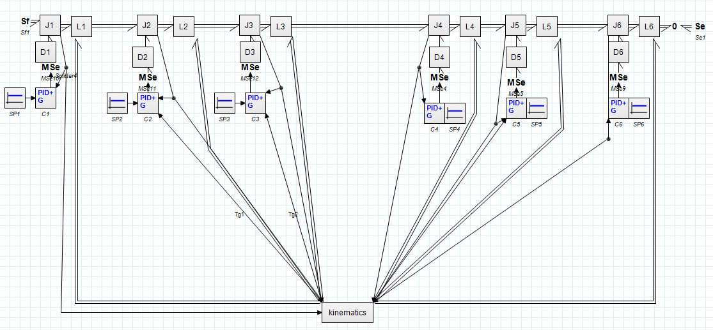
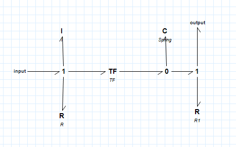
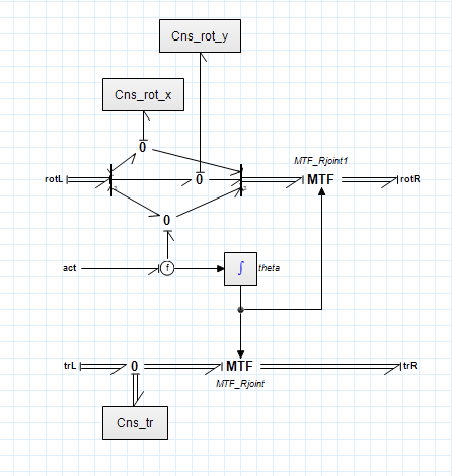
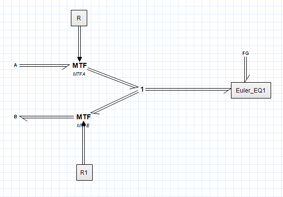
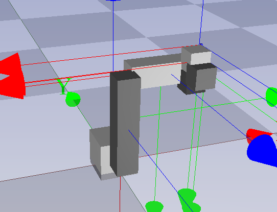

# Modeling and Simulation of a UR5 Robot Manipulator

[](https://www.20sim.com/)  
Energy-based modeling and simulation of a UR5 robotic arm using bond graphs, twists, wrenches, and PID-controlled dynamics.

---

## 🧠 About the Project

This project focuses on the **modeling and simulation** of the **UR5 manipulator** by Universal Robots.  
It employs an energy-based approach using **bond graphs**, **Screw Theory**, and **Euler dynamics** to simulate:

- Accurate joint behavior and torque response
- Gravity compensation and control robustness
- Detailed energy transfer along the robotic structure
- PID control combined with Harmonic Drives for each joint

Developed for the final project of **Modeling and Simulation of Mechatronic Systems** (2023/2024).

---

## 🗂 Project Structure

```
📦 ur5-manipulator-simulation/
├ 💻 UR5_PID_G.emx                       # Main code
├ 📘 UR5_Manipulator.pdf                 # Presentation
├ 📁 documents/                          # Additional documentation
│  ├ 📘 UR5_Manipulator.pdf
│  ├ 📘 MSMS_Project_Notes.pdf
│  ├ 📘 harmonic_drive_data_sheet.pdf
│  ├ 📘 ur5_data_sheet.pdf
│  ├ 📘 ur5_inverse_kinematics.pdf
│  ├ 📘 ur5_project_description.pdf
├ 📁 images/                            # Simulation diagrams
│  ├ 📸 full_model.png                  # Full UR5 bond graph model
│  ├ 📸 harmonic_drive.png              # Harmonic Drive subsystem
│  ├ 📸 joint.png                       # Joint subsystem
│  ├ 📸 link.png                        # Link subsystem
│  └ 📸 animation.png                   # 3D simulated movement
├ 📁 video/                             # Simulation video
│  └ 🎥 PID_Control_Simulation.mp4
├ 📄 README.md                          # You are here!
```

---

## ⚙️ How to Run

This project has been entirely developed and simulated in **20Sim**:

1. Open the main model file (`ur5_complete_model.nl`) inside 20Sim.
2. Set the simulation parameters:
   - Enable/disable gravity compensation.
   - Select PID tuning gains (Kp, Ki, Kd).
3. Run the simulation:
   - Monitor joint angles, velocities, and torques.
   - Analyze the energy flow and actuator response.
4. Visualize plots and bond graphs for each subsystem.

---

## 🛠️ Model Structure

<p align="center">
  
  
  
  
</p>

Each block models a key physical subsystem of the UR5 robot using **bond graphs**, ensuring correct energy flows and system behavior.

---

## 🎥 Output Visualization

<p align="center">
  
</p>

🎥 **Available Video**:  
- [PID Control Simulation (MP4)](./video/PID_Control_Simulation.mp4)

The animation shows the simulated real-time behavior of the UR5 under PID control and gravity compensation.

---

## 🔍 Technical Highlights

- **Bond Graph Modeling**: Complete energy transfer via multi-port and one-port elements.
- **Screw Theory**: Modeling with twists (velocities) and wrenches (forces and torques).
- **Coordinate Transformations**: Homogeneous Transformation Matrices (HTM) and Adjoint matrices.
- **Euler Equations**: Full body dynamics expressed in local body frames.
- **Harmonic Drive Modeling**:
  - Non-linear spring deformation
  - Damping bearings (hysteresis friction)
  - Torque amplification via mechanical transformer
- **Gravity Compensation**: Accurate projection of gravitational forces.
- **PID + Gravity Controller**:
  - Per-joint closed-loop regulation
  - Dynamic adjustment to compensate for weight and disturbances.

---

## 📊 Evaluation & Output

- Joint angle tracking vs setpoints
- Torque response at each motor
- Smooth energy-conserving motion
- Stability under gravity and dynamic loading
- 3D visualization of robot behavior

---

## 📅 Year

2024

---

## 👨‍🎓 Authors

- Andrea Perna  
- Giuseppe Speciale  
- Ammar Garooge  
- Meisam Tavakoli  

📧 andrea.perna3@studio.unibo.it

---

## 👩‍🏫 Supervisor

- Prof. Alessandro Macchelli

---

## 📎 Resources

- [📘 Project Presentation (UR5_Manipulator.pdf)](./documents/UR5_Manipulator.pdf)
- [📘 Project Notes (MSMS_Project_Notes.pdf)](./documents/MSMS_Project_Notes.pdf)
- [📘 Harmonic Drive Datasheet](./documents/harmonic_drive_data_sheet.pdf)
- [📘 UR5 Datasheet](./documents/ur5_data_sheet.pdf)
- [📘 UR5 Inverse Kinematics](./documents/ur5_inverse_kinematics.pdf)
- [📘 Project Description](./documents/ur5_project_description.pdf)
  [📘 Project Presentation](.UR5_Manipulator.pdf)

---

## 📜 License

All rights reserved. For academic and educational use only.
